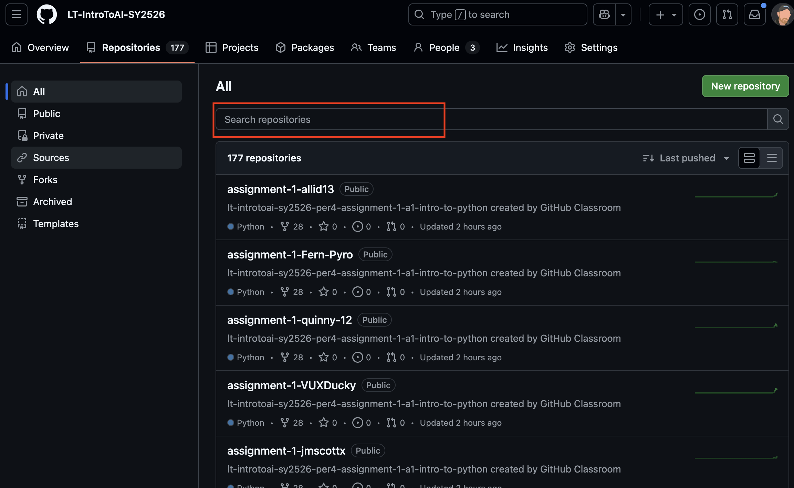

# How to access Berg's repository

## Navigate to your repository

The easiest way to get to your repository is probably through google classroom.  Go to the assignment and click on the link.

## Go to our organization homepage

Our ourganization is LT-IntroToAI-SY****.  You can get there by clicking on the our organization on the top left corner.  

*Note - You can access the syllabus and general information on the class in this section as well.

## Go to the Repositories

Click on the repositories tab.  You can access anyones repository here as a view only, including mine.

## Search for my repository

My username is *raberg1* - so if you click in the search bar and type in my username, then all of my repositories show up.  Click on the one that you would like to review and you will be able to see whatever I completed in class.

