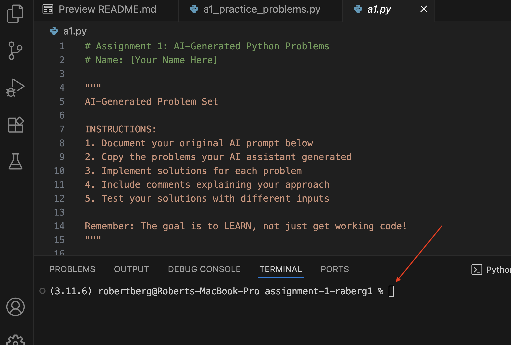
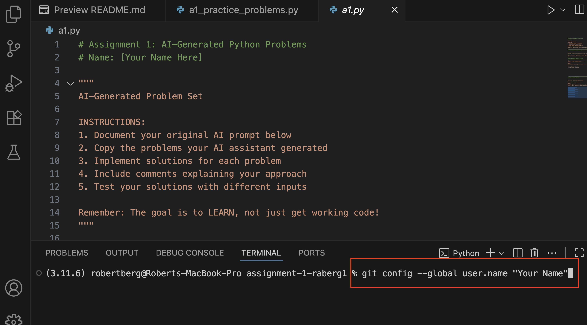
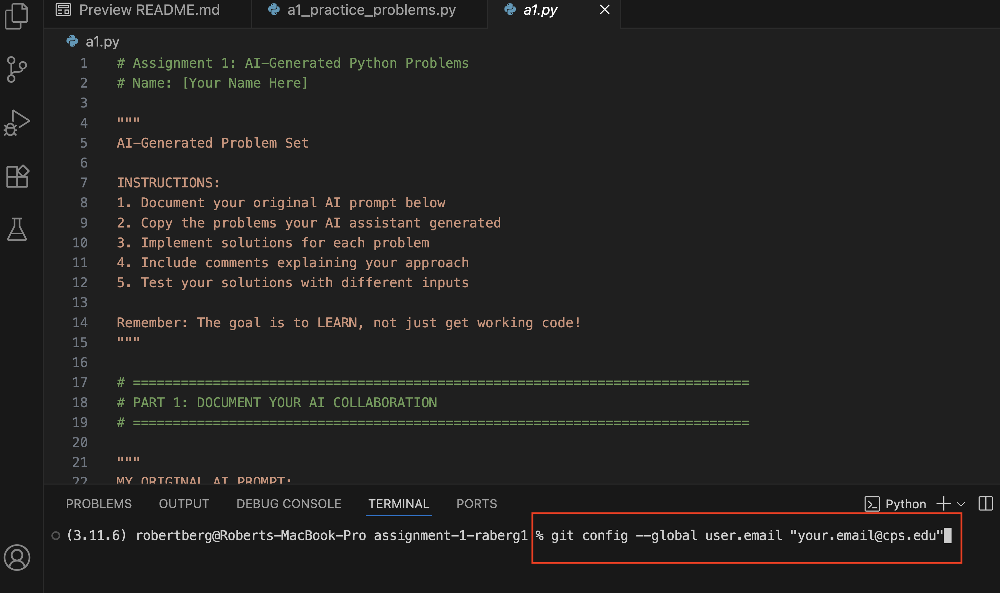
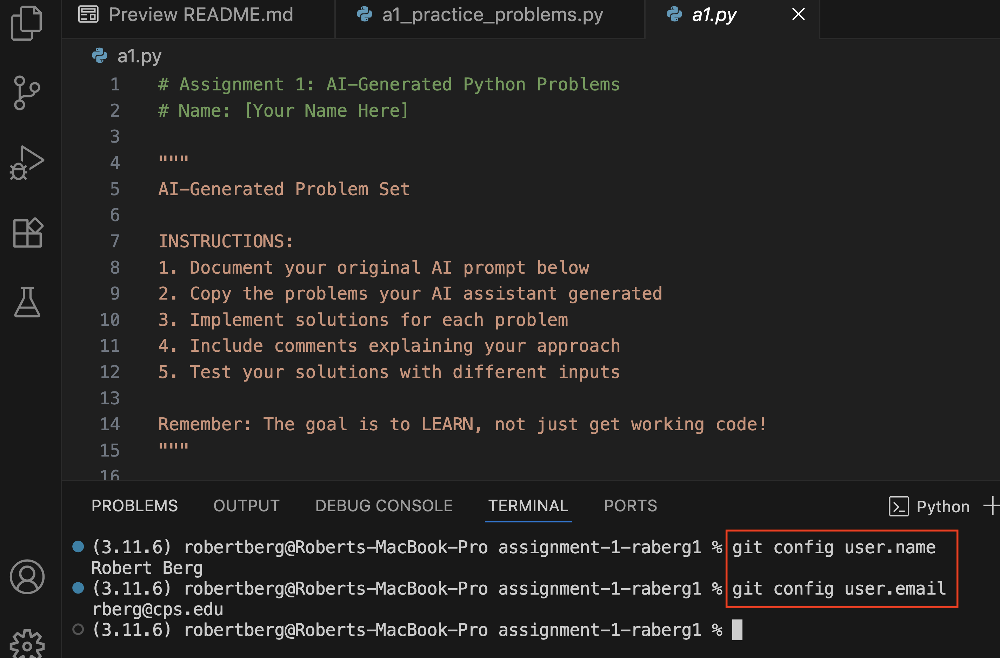

# GitHub Setup Help - Setting Your Username and Email

## Common Error: "Please tell me who you are"

If you're seeing an error message like this when trying to commit your work:

```
Please tell me who you are.
Run:
  git config --global user.email "you@example.com"
  git config --global user.name "Your Name"
```

Don't worry! This is a common issue that's easy to fix. Git just needs to know who you are before it can save your work.

## Quick Fix in VS Code

### Step 1: Open the Terminal in VS Code
- Go to **Terminal** → **New Terminal** (or press `Ctrl+Shift+`+` `)
- You should see a terminal window appear at the bottom of VS Code



### Step 2: Set Your Name
Type the following command and press Enter:
```bash
git config --global user.name "Your Full Name" 
```
*Replace "Your Full Name" with your actual name (keep the quotes!)*



### Step 3: Set Your Email
Type the following command and press Enter:
```bash
git config --global user.email "your-cps-email@cps.edu"

```
*Replace  "your-cps-email@cps.edu" with your actual CPS email address*



### Step 4: Verify It Worked
You can check that it worked by typing:
```bash
git config --global user.name
git config --global user.email
```
These should display the name and email you just set.



## Example
Here's what it looks like with actual values:
```bash
git config --global user.email "jsmith@cps.edu"
git config --global user.name "John Smith"
```

## Why This Happens
Git needs to know who is making changes to keep track of who contributed what to the project. This is especially important when working on group projects later in the semester.

## Still Having Issues?
- Make sure you're using your CPS email address
- Keep the quotes around your name and email
- If you're still stuck, raise your hand and Mr. Berg will help!

---

*Once you've completed these steps, you should be able to commit and push your assignments without any issues.*
